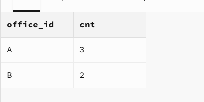
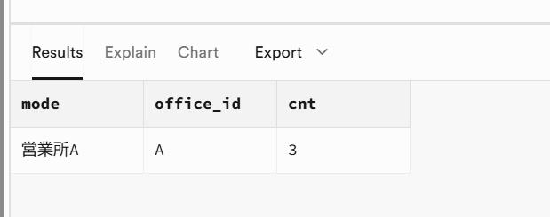
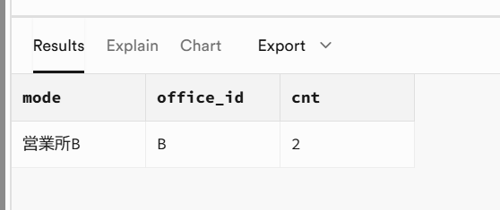

# 確認結果メモ（RLS動作確認：営業所別アクセス制御）

- 実施日: 2026 / 06 / 08
- 実施者: 蜂谷
- 対象テーブル: `public.deliveries`
- ポリシー: `select_own_office`（自分の営業所の行だけ SELECT 可）

## 実行したSQL（順序）

1. [ ] `create_table.sql`
2. [ ] `rls_policy.sql`
3. [ ] `seed_dummy.sql`
4. [ ] `check_rls.sql`

## 見えた件数

| 権限モード | 期待 | 実際に見えた件数 | 内訳(A / B) | 判定 |
|-----------|------|----------------|-------------|------|
| ① 管理者(RLS無視) | 5 | ５ | A:３ / B:２ | ☒OK ☐NG |
| ② 営業所A | 3 | ３ | A:__ / B:__ | ☒OK ☐NG |
| ③ 営業所B | 2 |２ | A:__ / B:__ | ☒OK ☐NG |

## 合格条件チェック

- [✓] 営業所Aの権限で、営業所Aの行だけが見える
- [✓] 営業所Aの権限で、営業所Bの行が1件も見えない
- [✓] 営業所Bの権限で、逆向きに同じことが確認できる
- [✓ ] 管理者(RLS無視)と営業所権限で、見える件数が変わる

## スクリーンショット / 備考

### ① 管理者（全件＝5件）

### ② 営業所A（3件・Bは0件）

### ③ 営業所B（2件・Aは0件）

### 備考
（気づき・補足があればここに）
